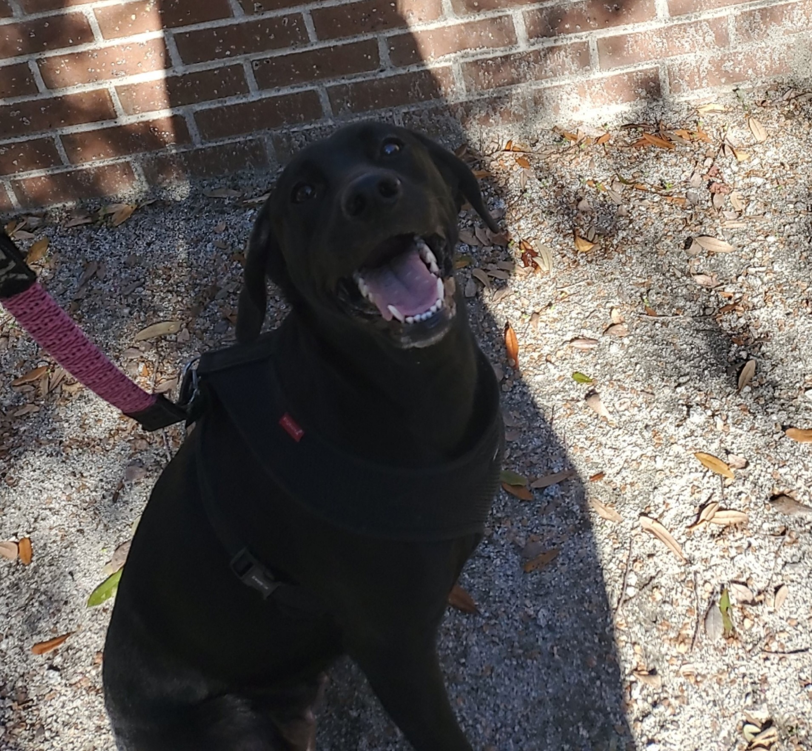

# Welcome to my blog for CSCI 362!

### HW0: Introduction

Hello! My name is Seth Hinson and I am a senior here at CofC. I made this blog to track my work during the course of my 362 class. A few examples of things I do in my free time are: video games, ethical hacking, building PCs, networking, and working on my personal server. I work as a Student Network Engineer with CofC along with Ethan Guthrie, check out his blog 
[here](https://eguthriewastaken.github.io)

For those interested, click to see my
[resume](resume.md)

I also have a dog, here's a picture of her.

### HW1: Chapter 1

[Read More...](hw1.md)

### HW3: Chapters 11 and 12

[Read More...](hw3.md)
